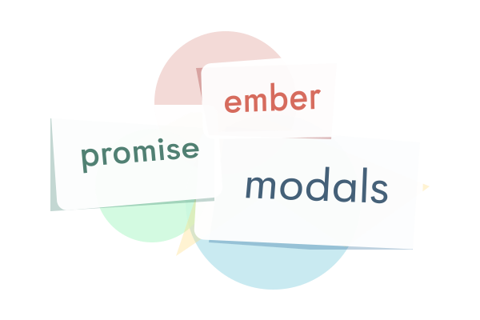

<p align="center"></p>

# ember-promise-modals

The better way to handle modals in your Ember.js apps.

## Compatibility

- Ember.js v3.4 or above
- Ember CLI v2.13 or above
- Node.js v10, v12, v14 or above

## Installation

```
ember install ember-promise-modals
```

## Usage

To use EPM in your project, add the target for the modals to your `application.hbs`:

```hbs
<EpmModalContainer />
```

Then you can to inject the `modals` service wherever you need and call its `open` method with a component name to render it as a modal.

```javascript
import { inject as service } from '@ember/service';

export default class extends Component {
  @service modals;

  @action
  handleOpenModal() {
    this.modals.open('confirmation-modal');
  }
}
```

```handlebars
<button type="button" {{on "click" this.handleOpenModal}}>
  Click Me!
</button>
```

### Passing data to the rendered component

You can pass custom data into your rendered template like so:

```javascript
this.modals.open('file-preview', {
  fileUrl: this.fileUrl,
});
```

All passed attributes can be accessed from the passed-in `data` object:

```handlebars
<!-- components/file-preview.hbs -->

```

```javascript
// components/file-preview.js
this.args.data.fileUrl; // or this.data.fileUrl in classic components
```

**NOTE:** By default, a `close` method is passed in your rendered component, in
order to trigger the "close modal" action. It can be called like so:

```handlebars
<!-- components/file-preview.hbs -->
<button {{on "click" @close}}>Close</button>
```

```javascript
// components/file-preview.js
this.args.close(); // or this.close() in classic components
```

## Animation

This addon uses CSS animations. You can either replace the
[styles of this addon](./addon/styles/ember-promise-modals.css) with your own
or adjust the defaults using CSS custom properties in your `:root{}`
declaration or in the CSS of any parent container of `<EpmModalContainer />`.

Available properties and their defaults can be found in the `:root {}` block inside the addons css.

By default, the animations are dropped when `prefers-reduced-motion` is
detected.

### Custom animations

To override the animation for a specific modal, an `options` object containing
a custom `className` can be handed to the `.open()` method.

```javascript
this.modals.open(
  'file-preview',
  {
    fileUrl: this.fileUrl,
  },
  {
    // custom class, see below for example
    className: 'custom-modal',
    // optional: name the animation triggered by the custom css class
    //           animations ending in "-out" are detected by default!
    //           You most likely do not have to do this unless you absolutely 
    //           can't have an animation ending in '-out'
    animationKeyframesOutName: 'custom-animation-name-out',
    // optional: a hook that is called when the closing animation of
    //           the modal (so not the backdrop) has finished.
    onAnimationModalOutEnd: () => {}
  },
);
```

```css
.custom-modal {
  animation: custom-animation-in 0.5s;
  opacity: 1;
  transform: translate(0, 0);
}

/* 
  The `.epm-out` class is added to the parent of the modal when the modal 
  should be closed, which triggers the animation
*/
.custom-modal.epm-out {
  animation: custom-animation-name-out 0.2s; /* default out animation is 2s */
  opacity: 0;
  transform: translate(0, 100%);
}

/* 
  animation name has to end in "-out" to be detected by the custom animationend 
  event handler 
*/
@keyframes custom-animation-name-out {
  0% {
    opacity: 1;
    transform: translate(0, 0);
  }
  100% {
    opacity: 0;
    transform: translate(0, 100%);
  }
}
```

The CSS animations which are applied by the custom CSS class _must_ end in
`-out` to make the animations trigger the modal removal.

#### Examples

Examples for custom animations and how to apply them can be found in the addons 
dummy application. 

See [the application.js controller](./tests/dummy/app/controllers/application.js) 
for how the modals are openend in your JavaScript actions and look at
[app.css](./tests/dummy/app/styles/app.css) for the style definition of these 
custom animations.

### CSS Variables

The addons CSS is run through PostCSS by default, which will create static
fallbacks for all custom properties using their defaults.

If your application uses PostCSS by itself, you can set `excludeCSS` to `true`
inside your `ember-cli-build.js`:

```js
let app = new EmberAddon(defaults, {
  // Add options here
  'ember-promise-modals': {
    excludeCSS: true,
  },
});
```

Done that, you can use [postcss-import](https://github.com/postcss/postcss-import)
to import the uncompiled addon styles in your projects `app/styles/app.css`:

```css
@import 'ember-promise-modals';
```

## Accessibility

User can press the <kbd>Esc</kbd> key to close the modal.

EPM uses [focus-trap](https://github.com/davidtheclark/focus-trap) internally
in order to handle user focus.

EPM will ensure to [focus the first "tabbable element" by default](https://www.w3.org/TR/wai-aria-practices-1.1/#dialog_modal).
If no focusable element is present, focus will be applied on the currently
visible auto-generated container for the current modal.

## Testing

This addon provides a test helper function that reduces the timing for the CSS transitions to near zero to speed up your tests.

```js
import { setupPromiseModals } from 'ember-promise-modals/test-support';

module('Application | ...', function (hooks) {
  // ...
  setupPromiseModals(hooks);
  // ...
});
```

## Migration guide

See the [Migration](MIGRATION.md) guide for details.

## Contributing

See the [Contributing](CONTRIBUTING.md) guide for details.

## License

This project is licensed under the [MIT License](LICENSE.md).
